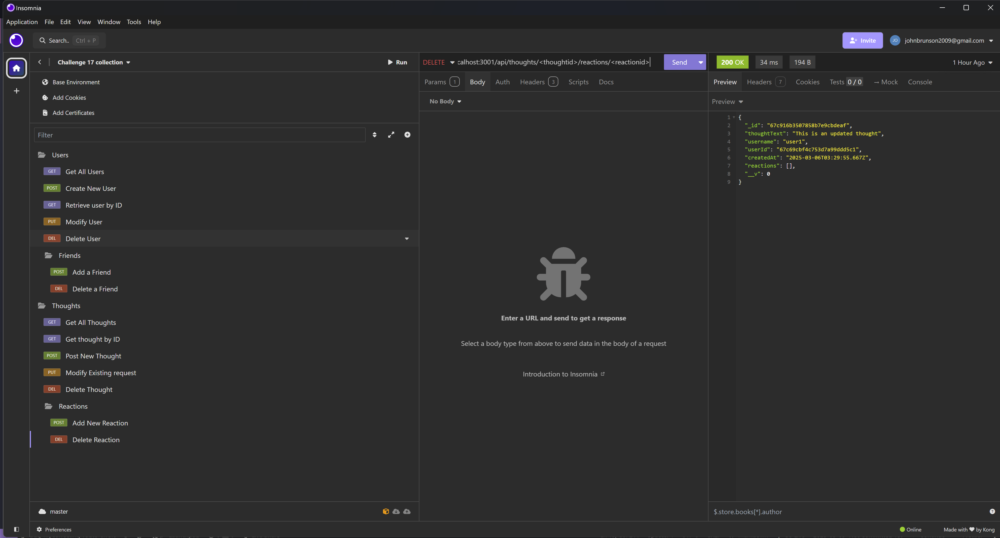

# Thoughts Social Network 

## Description

This is a sample backend using MongoDB for a thoughts social network. The thoughts social network is made up of users. Users, have thoughts and within those thoughts, users can react. This is somewhat of a simple demonstration of how MongoDB can be used. The motivation was to understand a bit more of what could be done with the software. It is a little more free form than traditional SQL, but you can force structure with mongoose.

## Installation

Installation is (hopefully) straight forward. Clone the repository and run ```npm run start```. The command will build the software and then run the server using express. 

## Usage

Since this is a backend only, there's not much I can show that would be visually pleasing. In time, I may build a front end for this along with additional items and information. For now, you can test the routes using some of the boiler plate provided in insomnia-route-testing. Postman will also likely work, but do note that neither it, nor the instructions provided have been tested using it. Please review and determine if you'd like to use it.

Please note that there is no authentication for this at this time. Again, this could be something for future development.

## Credits
N/A

## License
[MIT](https://choosealicense.com/licenses/mit/)